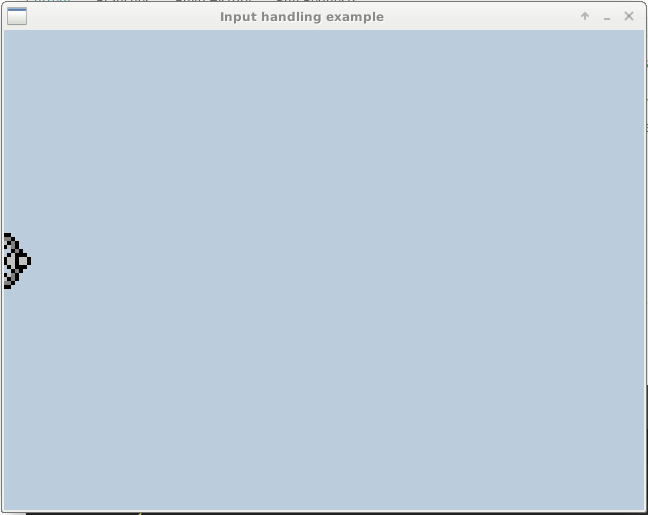

[](https://travis-ci.org/Ponup/php-sdl)

PHP-SDL
=======

SDL (Simple DirectMedia Layer) bindings for the PHP language. The extension allows you to create multimedia desktop applications with windows, input handling, events, and more.

[](input-handling-example.gif)

## Installation

### Requirements

* C compiler
* Automake tools
* PHP8.1 devel
* libSDL2 devel libraries and headers
* UN*X OS (eg Linux, Macos)

### Via PECL

```bash
pecl install sdl-devel
```

Then add 

```
extension=sdl.so
```
to your _php.ini_ file.

## Documentation

The SDL extension mimics in almost every single aspect to the official C library, so until we write our own documentation, refer to the [C counterpart](https://wiki.libsdl.org/APIByCategory).

## Examples

Standard SDL2 API is available in procedural style:

```php
$window = SDL_CreateWindow( "Foo window", 500, 50, 350, 300, SDL_WINDOW_SHOWN+SDL_WINDOW_RESIZABLE);
SDL_SetWindowTitle($window, "Some new title");
SDL_DestroyWindow($window);
```

And is also available in object oriented style:

```php
$window = new SDL_Window( "Foo window", 100, 50, 350, 300, SDL_Window::SHOWN|SDL_Window::RESIZABLE);
$window->SetTitle("Some new title");
unset($window); // will destroy the window
```

Complete examples can be found in the [examples](examples) folder.

## Projects using the extension

* [CubeCraft](https://github.com/Ponup/cubecraft)
* [Conway's game of life](https://github.com/Ponup/conways-game-of-life)
* [PhpOkoban](https://github.com/b-viguier/PhpOkoban)
* [Inphpinity](https://github.com/b-viguier/Inphpinity)
* [PhPresent](https://github.com/b-viguier/PhPresent)

## Building

To compile your new extension, you will have to execute the following steps:

```bash
phpize
./configure [--with--sdl] 
make
make test
sudo make install
```

